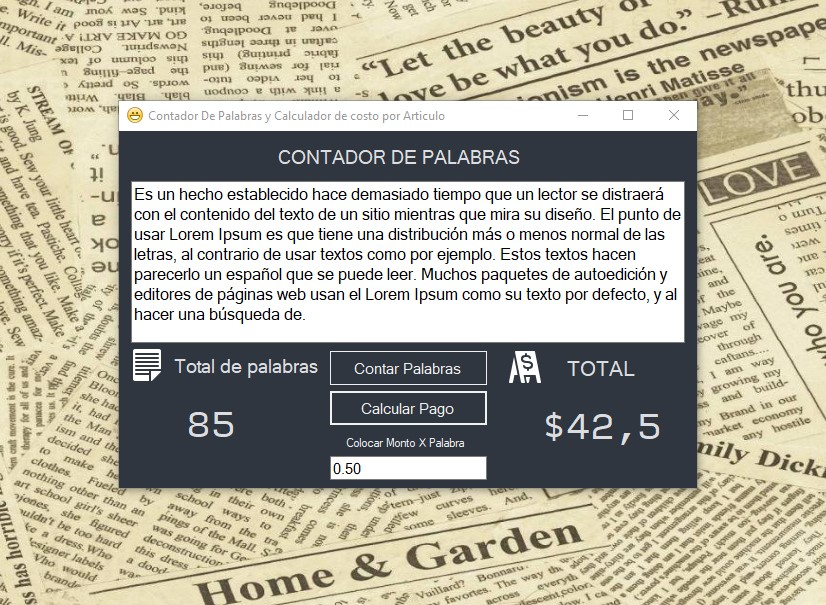

# CountPal 
## Version 1.0

### Que podemos mejorar en las siguientes versiones? 

* Control total de excepciones
* Mejoras generales en la Gui
* Atribuciones a autores y enlaces de ayuda
* Generador de informe

##### Aplicacion para contar palabras y calcular el costo de un articulo

**CountPal** es una aplicacion para windows que surge de una practica de arquitectura, basada en una arquitectura **N-capas** que si bien no pudo ser aplicada en su totalidad y tiende a pecar de antipatron, la misma se compone de las capas Entidad, logica de negocio, presentacion y persistencia, ademas en la carpeta **Instalador/Debug>** de este mismo proyecto podran encontrar el instalador **|SETUP.EXE|** con su respectivo **|CountPal.MSI|** con estos archivos la aplicacion puede instalarse.

### El programa es 100% gratis y libre para la comunidad.
###### -> Apoyo a la FreeSoftware Fundation
 **Copyright (C) 2019 Cristian M. Sguazzin**

    Este programa es software libre: puedes redistribuirlo y / o modificarlo.
    bajo los términos de la Licencia Pública General GNU tal como fue publicada por
    la Free Software Foundation, ya sea la versión 3 de la Licencia, o
    (a su elección) cualquier versión posterior.

    Este programa se distribuye con la esperanza de que sea útil,
    pero SIN NINGUNA GARANTÍA; sin siquiera la garantía implícita de
    COMERCIABILIDAD o APTITUD PARA UN PROPÓSITO PARTICULAR. Ver el
    GNU General Public License para más detalles.

    Debería haber recibido una copia de la Licencia Pública General de GNU
    junto con este programa. Si no, vea <https://www.gnu.org/licenses/>.

